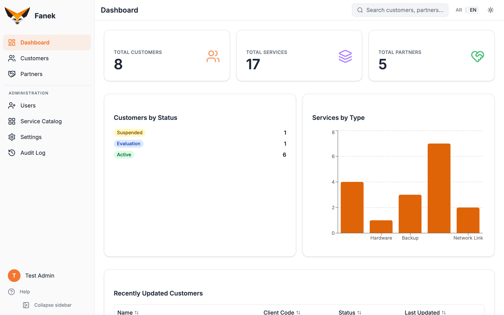
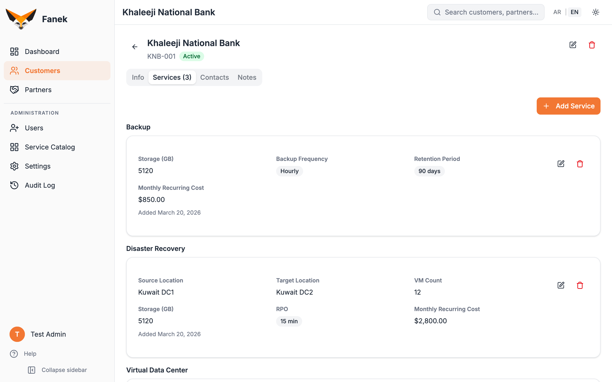
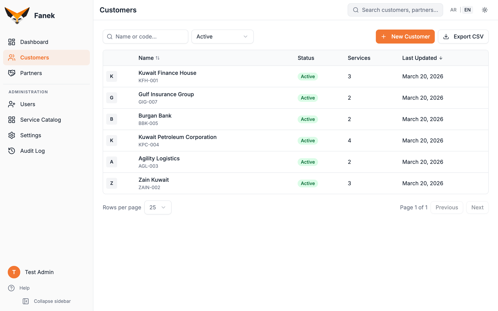
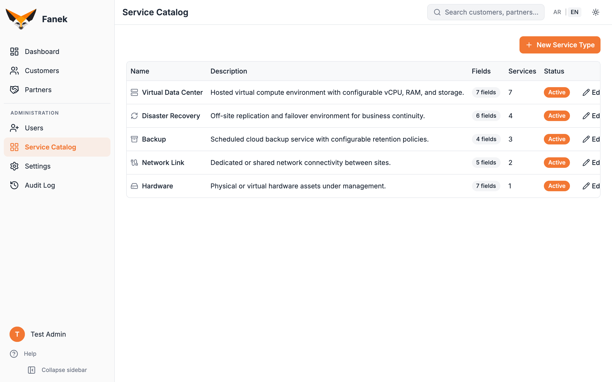

<p align="center">
  
</p>

<p align="center">
  <strong>Know which client has which service, at a glance.</strong>
</p>

<p align="center">
  <a href="https://github.com/mulaifi/fanek/actions/workflows/ci.yml"></a>
  <a href="https://github.com/mulaifi/fanek/blob/main/LICENSE"></a>
  <a href="https://github.com/mulaifi/fanek/releases"></a>
  
  
</p>

<p align="center">
  Fanek is an open-source record book for service providers.<br />
  Add your clients, define the services you offer, and track who subscribes to what.
</p>

## Why Fanek?

If you run an IT, cloud, telecom, or managed services company, you have clients and each client subscribes to some combination of your services. Your provisioning team sets up those services. Your support team needs to look them up ten times a day. Your operations team updates them as things change.

Everyone needs one place to answer: "What does this client have?" Not a spreadsheet that goes stale. Not a full CRM with sales pipelines you will never use. Just a clean, searchable record of your clients and their services.

That is what Fanek does. Nothing more, nothing less.

## Screenshots

| Dashboard | Customer Detail |
|:---------:|:---------------:|
|  |  |

| Customers List | Service Catalog |
|:--------------:|:---------------:|
|  |  |

## Key Features

| Feature | Description |
|---------|-------------|
| **Dynamic Service Catalog** | Admins define service types with custom field schemas; service records store field values as structured data |
| **Inline Editing** | All editing happens in context, no modal popups. Clean view/edit separation throughout |
| **Setup Wizard** | Guided first-run flow: create admin, set org details, pick a starter template (Cloud, Telecom, MSP, or Blank) |
| **Role-Based Access** | Three roles: Admin (full access), Editor (create/edit), Viewer (read-only) |
| **Configurable Statuses** | Customer statuses ship with sensible defaults, fully customizable via the UI |
| **Contacts Manager** | Multiple contacts per customer/partner, each with multiple emails and phones |
| **Audit Log** | Structured logs for all data changes with user attribution and JSON detail |
| **Global Search** | Spotlight-style search (Cmd+K) across customers, partners, and services |
| **CSV/JSON Export** | Export customer and partner data for reporting and integrations |
| **OAuth Support** | Enable Google or other OAuth providers via Admin Settings (no file edits) |
| **English and Arabic** | Full bilingual UI with RTL support; users switch language from the navigation bar |
| **Dark/Light Mode** | Toggle between dark (default) and light themes |
| **Docker Ready** | Ship and run with a single `docker compose up` |
| **CLI Admin Tools** | `npm run reset-password` and `npm run list-users` for server-side admin |

## Quick Start

### Docker (recommended)

```bash
git clone https://github.com/mulaifi/fanek.git
cd fanek
docker compose up -d
```

Open [http://localhost:3000](http://localhost:3000) and follow the setup wizard. That's it.

Secrets are auto-generated, the database is created and migrated automatically. See the [Admin Guide](docs/en/admin-guide.md) for production configuration and customization.

### Manual Installation

Requires Node.js 20+ and PostgreSQL 16+. See the [Admin Guide](docs/en/admin-guide.md#1-installation) for step-by-step instructions.

## Documentation

**English:**
- [Admin Guide](docs/en/admin-guide.md) -- Installation, setup, user management, service catalog configuration
- [User Guide](docs/en/user-guide.md) -- Day-to-day usage: customers, services, partners, search
- [Production Deployment Guide](docs/en/production-guide.md) -- Reverse proxy, SSL, firewall, backups, and maintenance

**العربية:**
- [دليل المسؤول](docs/ar/admin-guide.md) -- التثبيت، الإعداد، إدارة المستخدمين، تهيئة كتالوج الخدمات
- [دليل المستخدم](docs/ar/user-guide.md) -- الاستخدام اليومي: العملاء، الخدمات، الشركاء، البحث

## Tech Stack

| Layer | Technology |
|-------|-----------|
| Framework | [Next.js](https://nextjs.org/) 16 (Pages Router) |
| UI | [Tailwind CSS](https://tailwindcss.com/) v4 + [shadcn/ui](https://ui.shadcn.com/) |
| Database | [PostgreSQL](https://www.postgresql.org/) 16+ |
| ORM | [Prisma](https://www.prisma.io/) 7 |
| Auth | [NextAuth.js](https://next-auth.js.org/) (credentials + OAuth) |
| Logging | [Pino](https://getpino.io/) (structured JSON) |
| Testing | [Jest](https://jestjs.io/) + [Playwright](https://playwright.dev/) |
| Container | [Docker Compose](https://docs.docker.com/compose/) |

## Environment Variables

| Variable | Required | Description |
|----------|:--------:|-------------|
| `DATABASE_URL` | Yes | PostgreSQL connection string |
| `NEXTAUTH_SECRET` | Manual only | Random secret for session signing (auto-generated in Docker) |
| `NEXTAUTH_URL` | Manual only | Full URL of the app (defaults to `http://localhost:3000` in Docker) |
| `PORT` | No | HTTP port (default: 3000) |

## Project Structure

```
fanek/
├── prisma/           # Schema and seed data (starter templates)
├── lib/              # Utilities: auth, encryption, validation, logging, audit
├── pages/            # Next.js pages and API routes
│   └── api/          # REST API handlers
├── components/       # React UI components
├── styles/           # Global CSS
├── public/           # Static assets and logos
├── scripts/          # CLI admin tools (reset-password, list-users)
├── __tests__/        # Jest unit/integration + Playwright E2E
└── docs/             # Testing plans and documentation
```

## Admin CLI Tools

If an admin loses their password, reset it from the server command line:

```bash
# Generate a random temporary password (user must change on next login)
npm run reset-password admin@example.com

# Set a specific password
npm run reset-password admin@example.com -- --password MyNewPass123!

# List all users
npm run list-users
```

## Contributing

See [CONTRIBUTING.md](CONTRIBUTING.md).

Please read our [Code of Conduct](CODE_OF_CONDUCT.md) before contributing.

## License

[MIT](LICENSE) -- Made in Kuwait 🇰🇼
